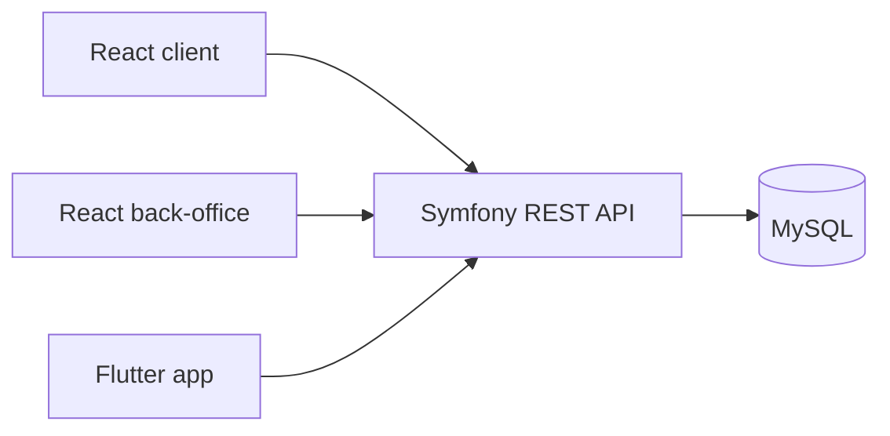

# Architecture

## Vue d'ensemble

Symfony centralise la logique métier et expose une API REST JSON. React client, React back-office et Flutter ne calculent pas les totaux de commande, ne valident pas les rôles et ne créent pas directement les commandes : ils envoient les intentions utilisateur à l'API.

## Responsabilités

- `backend-symfony` : sécurité, validation, calcul panier/commande, rôles, CRUD admin, fixtures.
- `frontend-react` : expérience e-commerce client, panier visiteur local, compte, commandes.
- `backoffice-react` : administration protégée, CRUD, dashboard.
- `mobile-flutter` : application mobile consommant l'API.
- `database` : SQL de référence pour la structure et les données de démonstration.
- `docs` : installation, architecture, API et dictionnaire technique.

## Flux de données

1. Le client consulte les produits via `GET /api/products`.
2. Le panier visiteur reste en `localStorage`.
3. Une fois connecté, les ajouts passent par `POST /api/cart/items`.
4. Le checkout appelle `POST /api/checkout`.
5. Symfony vérifie le panier, calcule le total, crée la commande, le paiement mock et les abonnements.
6. Le back-office modifie produits, catégories et contenus d'accueil via les routes `/api/admin/*`.
7. Les données modifiées sont persistées dans MySQL et visibles ensuite sur le site client et l'app mobile.

## Sécurité

- Les mots de passe sont hashés côté Symfony.
- Le login renvoie un JWT signé.
- Les routes utilisateur exigent un token valide.
- Les routes admin exigent `ROLE_ADMIN`.
- Les numéros de carte bancaire ne sont jamais stockés.
